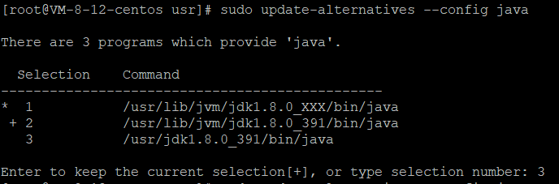
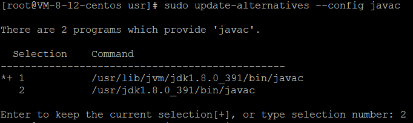

### 服务器环境

#### MYSQL安装

1. 安装

   ```SPARQL
   # 资料
   https://www.linode.com/docs/guides/how-to-install-mysql-on-centos-7/
   
   # 安装
   yum install wget
   wget http://repo.mysql.com/mysql80-community-release-el7-11.noarch.rpm
   sudo rpm -ivh mysql80-community-release-el7-11.noarch.rpm
   yum update
   sudo yum install mysql-server
   
   # mysql默认启动
   sudo systemctl enable mysqld
   
   # 启动
   sudo systemctl start mysqld
   ```

2. 安全配置

   ```SPARQL
   # 获得root的临时密码
   sudo grep 'temporary password' /var/log/mysqld.log
   
   # 安全配置
   sudo mysql_secure_installation
   
   # 安全设置如下
   重置root密码为：LuckyCloudAdmin001!
   禁用root远程登录.
   
   # 进入mysql
   mysql -u root -p
   # 允许弱密码
   SET GLOBAL validate_password.policy = LOW;
   # 创建新账号
   CREATE USER 'lucky_cloud_sys'@'%' IDENTIFIED BY 'lucky_cloud_sys';
   # 赋予最大的权限
   GRANT ALL PRIVILEGES ON *.* TO 'lucky_cloud_sys'@'%';
   # 确认更改
   FLUSH PRIVILEGES;
   ```

#### NACOS搭建

1. 首先安装JAVA开发环境，下载JDK8  
   官网`https://www.oracle.com/java/technologies/downloads/`  
   下载好后直接拖入`/usr`目录下

2. 解压`jdk-8u391-linux-x64.tar.gz`文件
   ```SPARQL
   cd /usr/
   tar -xvf jdk-8u391-linux-x64.tar.gz
   ```

3. 更新系统的 Java 配置
   ```SPARQL
   sudo update-alternatives --install /usr/bin/java java /usr/jdk1.8.0_XXX/bin/java 1 
   sudo update-alternatives --install /usr/bin/javac javac /usr/jdk1.8.0_XXX/bin/javac 1
   # XXX 为你下载的 JDK 版本号，此处替换为391
   ```

4. 选择默认 Java 版本
   ```SPARQL
   # 选择默认 Java 版本
   sudo update-alternatives --config java
   sudo update-alternatives --config javac
   ```
   
   

5. 验证Java安装是否成功
   ```SPARQL
   java -version
   ```

6. 下载 Nacos 1.4.1版本
   ```SPARQL
   #在Linux 服务器上，使用 wget 命令下载 Nacos
   wget https://github.com/alibaba/nacos/releases/download/1.4.1/nacos-server-1.4.1.tar.gz
   ```

7. 解压安装包
   ```SPARQL
   tar -xvf nacos-server-1.4.1.tar.gz
   ```

8. 进入 Nacos bin目录
   ```SPARQL
   cd nacos/bin/
   ```

9. 编辑 nacos/bin/startup.sh
   ```SPARQL
   vim ./startup.sh
   export MODE="standalone"
   ```

10. Nacos 默认使用 H2 数据库，如果需要使用 MySQL 等数据库，需编辑 nacos/conf/application.properties文件
   ```SPARQL
   vim nacos/conf/application.properties
   # 修改MySQL配置
   spring.datasource.platform=mysql
   db.num=1
   db.url.0=jdbc:mysql://127.0.0.1:3306/nacos?characterEncoding=utf8&connectTimeout=1000&socketTimeout=3000&autoReconnect=true&useUnicode=true&useSSL=false&serverTimezone=UTC
   db.user.0=lucky_cloud_sys
   db.password.0=lucky_cloud_sys
   ```

11. 执行位于`/数据脚本/nacos/nacos.sql`的脚本。